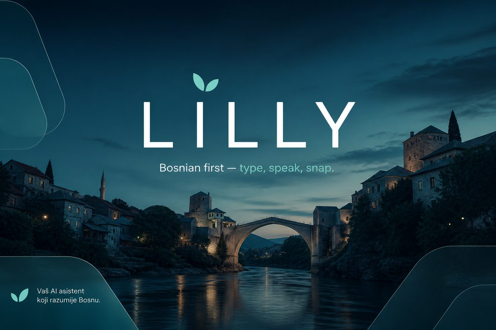
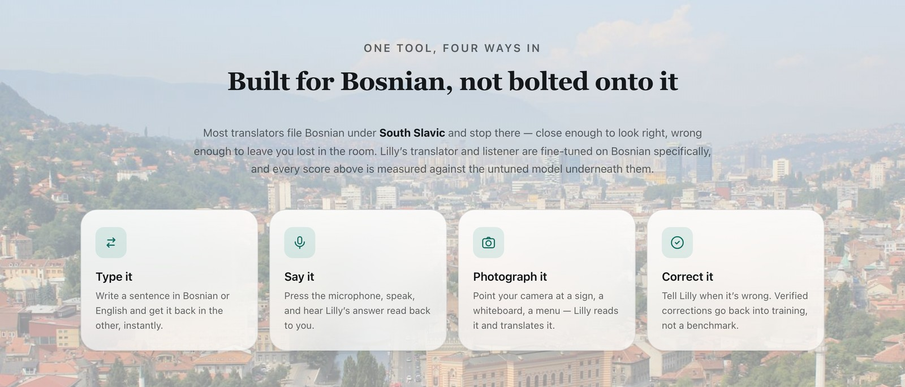
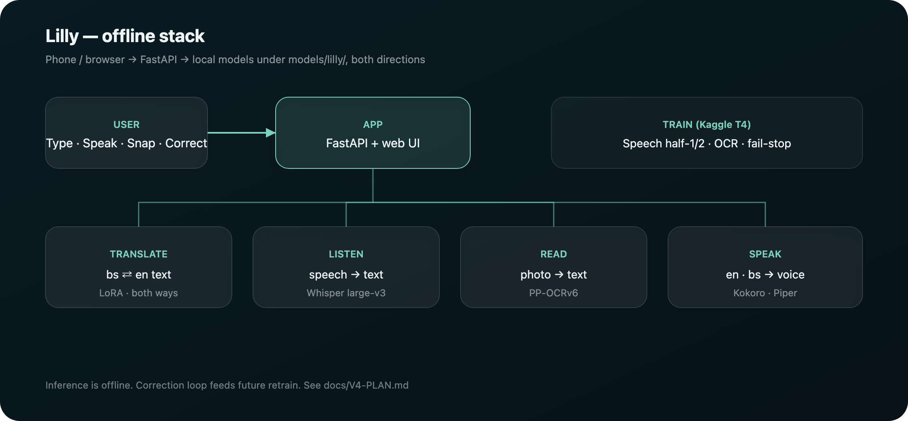
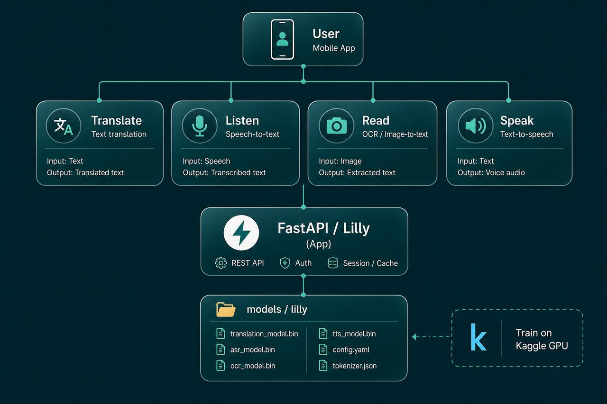
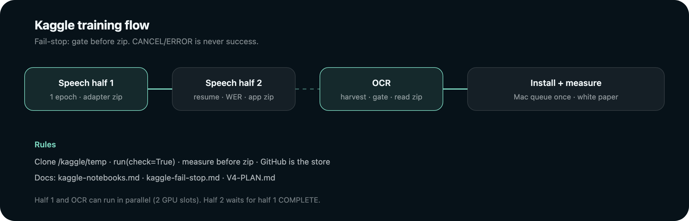

# Lilly



<p align="center">
  <strong>The only assistant that speaks Bosnian</strong> — 
</p>

<p align="center">
  <a href="https://www.python.org/downloads/"></a>
  <a href="https://fastapi.tiangolo.com/"></a>
  <a href="docs/V3-PLAN.md"></a>
  <a href="docs/kaggle-fail-stop.md"></a>
</p>

Everybody else ships one South Slavic model and calls it a day. Google does it.
DeepL does it. The big labs do it. They dump you in the same bucket and hope you
do not notice.

**We noticed. We built Lilly anyway.**

Type Bosnian. Say Bosnian. Point your phone at a Bosnian sign. Get English back
from a stack that was **trained, measured, and shipped for Bosnian** — not
relabeled at the last minute.

---

## Why I built this

I applied for an internship. They didn’t take me.

Not because my code was weak. The reason was shorter, colder: I didn’t know
Bosnian.

I had heard some version of that sentence before — during internships, job
applications, and conversations that ended before they really began.

Same sentence. Different room.

At some point, language stopped feeling like a language and started feeling like
a door. A door I was always standing on the wrong side of.

The frustrating part was that Bosnian itself was never the problem. It was
learnable. The problem was the technology around it.

Most tools treated Bosnian as a rounding error: one more language inside a
broader South Slavic category, perhaps a different flag on the interface. The
technology could recognize the region. But recognizing South Slavic is not the
same as understanding Bosnian.

So I started asking myself a few simple questions:

If someone is speaking Bosnian, why can’t I press a microphone and hear it in
English?

If someone writes something on a board, why can’t I take a photo and understand
it?

If I need to respond, why can’t I type what I mean and have it spoken out loud?

These didn’t feel like impossible problems.

They felt like problems nobody had bothered to solve properly.

So I decided to build it myself.

I trained on real Bosnian, deliberately. I measured it. I tested it. And I
published the numbers — including the ones that didn’t flatter me.

Type. Speak. Snap.

That decision became Lilly.

They told me I didn’t know Bosnian.

So I built the thing that understands it.

I build things because when I run into a problem, I’d rather solve it than accept
that it can’t be solved.

Full story: [`docs/STORY.md`](docs/STORY.md).

---

## Three ways in



| | What you do | What Lilly does |
| --- | --- | --- |
| **Type** | Write Bosnian | English that respects č, ć, đ, š, ž |
| **Speak** | Talk into the mic | Hears **Bosnian speech**, answers in spoken English |
| **Snap** | Photograph a sign, menu, monument | Reads **street Bosnian** and translates it |

Most translators stop at the keyboard. Lilly lives where Bosnian actually lives:
**voice and signage.**

---

## Architecture



Four abilities, one folder, **zero network at inference**:

```text
Phone / browser
    → FastAPI glass UI (app/)
        → translate  (bs → en text)
        → listen     (speech → bs text)     Whisper large-v3
        → read       (photo → bs text)      EasyOCR + lilly.pth
        → speak      (en text → voice)
```

```python
from app.lilly import lilly

lilly.translate("Dobar dan")
lilly.listen("clip.m4a")
lilly.speak("Good day", "out.wav")
lilly.read("sign.jpg")
```

Illustrated overview (same stack):



Training runs on **Kaggle GPU**. The Mac commits, launches, and fetches — it does
not suffer multi-hour fine-tunes. Contract: [`docs/V2-BOUNDARIES.md`](docs/V2-BOUNDARIES.md).

---

## The feature nobody else has

**“This translation is wrong.”**

Press it. Say what’s right. We verify it. It goes back into the training pool.
That is Lilly getting **more Bosnian every time someone cares enough to correct it.**

---

## Numbers that hold up

| | Result |
| --- | --- |
| **Translation** | chrF2 **67.47** on 2,009 FLORES pairs |
| **Speech** | **34.9%** WER on held-out Bosnian — v3 trains **whisper-large-v3** in two Kaggle halves |
| **Street photos** | **54.7%** words correct per photo (Commons signs, blind labels; was 36%) |
| **Honesty** | BosnianBench does not flatter us. We publish that too. |

We pre-register thresholds. We bind builds to hashes. We do not move the goalposts.

---

## Training right now (v3)



| Lane | What | Gate before zip |
| --- | --- | --- |
| **Speech half 1** | 1 epoch → `lilly-listen-half1.zip` (Trainer adapter) | Train exit 0 — no WER here |
| **Speech half 2** | `--resume` epoch 2 → AFTER **WER** → `lilly-listen.zip` | WER must pass |
| **OCR pass-7c** | Harvest + real crops + syn → install gate → `lilly-read.zip` | Gate must pass |

**Fail-stop:** a known failure stops the kernel. COMPLETE / a leftover zip / the
12h wall must not override the gate.

Live status and half-2 wait checklist: **[`docs/V3-PLAN.md`](docs/V3-PLAN.md)**  
How to write notebooks: **[`docs/kaggle-notebooks.md`](docs/kaggle-notebooks.md)**  
Mistake list: **[`docs/kaggle-fail-stop.md`](docs/kaggle-fail-stop.md)**  
Docs map: **[`docs/README.md`](docs/README.md)**

```bash
python3 scripts/preflight_kaggle.py
python3 scripts/kaggle_train.py speech          # half 1
python3 scripts/kaggle_train.py ocr             # parallel if a GPU slot is free
# after half 1 COMPLETE + fresh half1 zip:
python3 scripts/kaggle_train.py speech-half2
python3 scripts/kaggle_poll.py                  # CANCEL/ERROR = fail
```

---

## Run it locally

```bash
uv venv .venv --python 3.12
uv pip install --python .venv/bin/python -r requirements.txt
.venv/bin/python scripts/fetch_models.py
.venv/bin/python scripts/build_translator.py
.venv/bin/uvicorn app.server:app --port 8000
```

Open **http://localhost:8000**. Mic on. Photograph something with **đ** in it.

---

## Repo map

| Path | What |
| --- | --- |
| `app/` | FastAPI server + glass web UI |
| `models/lilly/` | Offline weights (translate, listen, read, speak) |
| `training/` | Kaggle notebooks + train/eval scripts |
| `scripts/` | `kaggle_train.py`, preflight, poll, fetch |
| `docs/` | Plans, fail-stop, notebook law, white paper |
| `data/` | Corpora, OCR crops/harvest (large; often local) |
| `space/` | Hugging Face Space packaging |

---

## Who this is for

- **Diaspora** tired of tools that butcher the language their parents speak  
- **Visitors** in BiH who need a sign translated **now**  
- **Learners** who want Bosnian, not “South Slavic (approx)”  
- **Engineers** who want a reproducible offline stack with honest metrics  

---

## Status

- [x] Ship-quality v1 — translate, listen, speak, read, web app, correction export  
- [x] v3 ops — fail-stop, speech halves, OCR harvest required, docs on GitHub  
- [ ] Hugging Face publish (owner gate)  
- [ ] **Kaggle in flight** — speech half 1 + OCR; half 2 waiting on half 1 COMPLETE  
- [ ] End measurement evening + white-paper fill  

---

**Lilly.** Real Bosnian. Not the excuse everyone else sells you.

Built by [@ssaaffaakk](https://github.com/ssaaffaakk).
