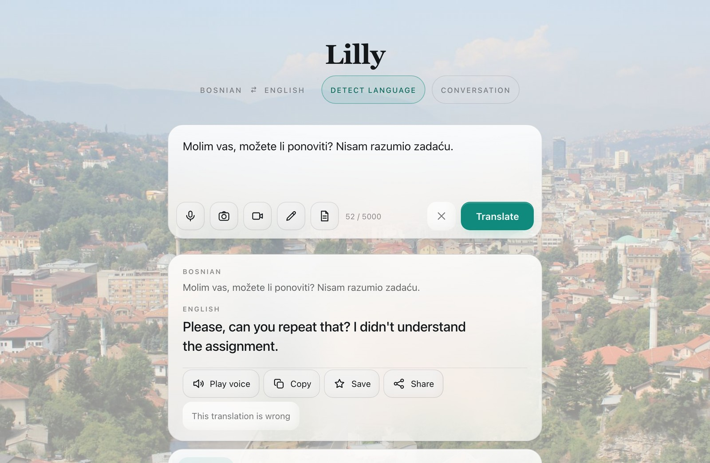

<h1 align="center">Lilly</h1>

<p align="center"><strong>A Bosnian translator you can type into, talk to, or point a camera at — running entirely on your own machine.</strong></p>

<p align="center">
  <a href="#run-it"></a>
  <a href="#whats-inside"></a>
  <a href="#how-well-it-works"></a>
  <a href="https://huggingface.co/Safak11/lilly"></a>
</p>

<p align="center">
  
</p>

<p align="center">
  <a href="#why-i-built-it">Why</a> ·
  <a href="#see-it-work">Examples</a> ·
  <a href="#run-it">Run it</a> ·
  <a href="#whats-inside">Inside</a> ·
  <a href="#how-well-it-works">Numbers</a> ·
  <a href="#what-it-cannot-do-yet">Limits</a> ·
  <a href="#training">Training</a>
</p>

---

## Why I built it

I applied to a lot of internships and kept getting turned down for the same
reason: I did not know Bosnian.

I could not learn a language in a week, so I built the thing I needed instead.
Lilly is a translator I made for myself. In class and at work I press the
microphone, say what I just heard, and get it back in English. I point the
camera at a whiteboard or a sign and read it. I type what I want to say in
English and Lilly gives me the Bosnian to say back.

I tried the tools that already existed. Google Translate and the rest kept
getting my sentences wrong — close enough to look right, wrong enough to leave
me lost in the room. They also treat Bosnian as one more entry in a South Slavic
bucket, and that is not the same thing as understanding it.

So I trained the models myself, measured them against the untuned versions they
started from, and published every number, including the ones that say the
fine-tuning did nothing. Lilly is how I show that I can work in Bosnian and that
I can build something serious when I hit a wall.

The longer version is in [`docs/STORY.md`](docs/STORY.md).

---

## See it work


Real output from the running app, not hand-picked from a benchmark.

**Bosnian → English**

| You type | Lilly returns |
| --- | --- |
| Molim vas, možete li ponoviti? Nisam razumio zadaću. | Please, can you repeat that? I didn't understand the assignment. |
| Sastanak je sutra u devet u kancelariji na drugom spratu. | The meeting is tomorrow at nine in the office on the second floor. |
| Rok za predaju projekta je sljedeći petak. | The deadline for handing over the project is next Friday. |

**English → Bosnian**, for saying something back

| You type | Lilly returns |
| --- | --- |
| Could you send me the file before the meeting? | Možete li mi poslati dosje prije sastanka? |
| I am still learning Bosnian, please be patient with me. | Još učim bosanski, molim vas budite strpljivi sa mnom. |

Speech and photographs go through the same translator, so a spoken sentence and
a photographed sign come back the same way a typed one does.

---

## Run it

```bash
uv venv .venv --python 3.12
uv pip install --python .venv/bin/python -r requirements.txt
.venv/bin/python scripts/fetch_models.py        # pulls the weights bundle
.venv/bin/python scripts/build_translator.py
.venv/bin/uvicorn app.server:app --port 8000
```

Open http://localhost:8000. Allow the microphone, or photograph something with a
**đ** in it.

That gives you the four abilities in the published bundle. The reply direction —
English in, Bosnian out, the swap button in the UI — is built locally from an
upstream base instead of shipped in the bundle, so it takes two more commands:

```bash
.venv/bin/python scripts/fetch_translate_base.py --direction en-bs
.venv/bin/python scripts/build_translator.py --direction en-bs
```

Without them the app runs fine and `/api/reply` answers 503. `python3 app/lilly.py`
prints which parts are installed and says so rather than leaving you to find out
from the swap button.

Startup is instant because each model loads on first use, so an unused ability
costs nothing. Once the weights are on disk, nothing reaches the network again.

---

## What's inside


Every ability sits behind one object and one API.

```python
from app.lilly import lilly

lilly.translate("Dobar dan")          # Bosnian text   -> English text
lilly.reply("Good morning")           # English text   -> Bosnian text
lilly.listen("clip.m4a")              # spoken Bosnian -> Bosnian text
lilly.read("sign.jpg")                # photo          -> Bosnian text
lilly.speak("Good day", "out.wav")    # English text   -> spoken English
```

| Endpoint | Body | Returns |
| --- | --- | --- |
| `POST /api/translate` | `{"text": "..."}` | Bosnian in, English out |
| `POST /api/reply` | `{"text": "..."}` | English in, Bosnian out |
| `POST /api/speech` | audio upload | transcribes Bosnian, then translates it |
| `POST /api/photo` | image upload | reads Bosnian off the image, then translates it |
| `POST /api/speak` | `{"text": "..."}` | English speech as WAV |
| `POST /api/feedback` | a correction | stored for review and retraining |
| `GET /health` | — | liveness |

Every request is bounded before it reaches a model — uploads by size, text by
how much work it asks for, images by pixel count — because the server is written
to face the open internet.

### The correction button

When a translation is wrong, you press **This translation is wrong**, say what
it should have been, and the correction is stored for review. Verified
corrections go back into the training pool, so the model improves on the
sentences people actually hit rather than the ones a benchmark happens to
contain.

### Weights it is built from

Lilly is a bundle, not a new architecture. The translator, the listener, and the
OCR recogniser are fine-tuned here; the voice is stock. Full attribution and
licenses are in [`models/lilly/NOTICE.md`](models/lilly/NOTICE.md).

| Ability | Built from | Fine-tuned here |
| --- | --- | --- |
| Translate | OPUS-MT [`opus-mt-tc-big-zls-en`](https://huggingface.co/Helsinki-NLP/opus-mt-tc-big-zls-en) (Helsinki-NLP), CTranslate2 int8 | yes — LoRA merged into the weights |
| Listen | [`faster-whisper-small`](https://huggingface.co/Systran/faster-whisper-small) (SYSTRAN conversion of OpenAI Whisper) | yes — LoRA |
| Read | [EasyOCR](https://github.com/JaidedAI/EasyOCR), CRAFT detector by Clova AI | recogniser only |
| Speak | [Kokoro-82M](https://huggingface.co/hexgrad/Kokoro-82M) (hexgrad) | no — stock weights |

---

## How well it works

Every number below compares Lilly against the untuned model it started from, on
data held out of training, run through the app's own code path so the only
difference between the columns is the fine-tuning.

**Translation** — 2,009 held-out FLORES-200 Bosnian–English pairs, paired
bootstrap for significance.

| | Base | Lilly | Change |
| --- | --- | --- | --- |
| BLEU | 40.81 | **42.18** | **+1.37**, p = 0.001 |
| chrF2 | 67.34 | 67.47 | +0.14, p = 0.104 — not significant |
| Outputs with the model's language tag leaked into them | 572 of 2,009 (28.5%) | **0** | the defect a reader actually sees |

Read that honestly: the fine-tuning buys word-level accuracy and removes a
visible defect. It does not improve chrF2 — it stopped costing anything there,
which an earlier version of this same fine-tune did not manage.

**Speech** — 200 held-out FLEURS Bosnian clips, the same clips before and after.

| | Before | Now |
| --- | --- | --- |
| Word error rate | 38.5% (stock Whisper-small) | **34.9%** |
| Bosnian term recall | 65.9% | **68.2%** |
| Wrong-variety substitutions | 5.1% | **3.3%** |

**Photographs** — 40 photographs of Bosnian signs from Wikimedia Commons. Two
readers transcribed them independently, seeing neither each other's work nor the
model's guess; only words both of them saw are in the answer key.

| | Before | Now |
| --- | --- | --- |
| Words found per photograph | 36.0% | **54.7%** |
| Words invented that are on no sign | 224 | **180** |

The second row matters as much as the first. Recall can always be bought by
guessing more; this reader guesses less and finds more.

**Thresholds are written before the run.** Deciding measurements and their pass
marks live in [`training/PREREGISTRATION.md`](training/PREREGISTRATION.md),
fixed before any number exists. Two retraining arms were run for the translator
and the pre-written tie-break chose the one with the *lower* headline BLEU,
because the rule said chrF2 decides. Published scores are bound to the weights
by content hash, so the numbers and the model cannot drift apart.

---

## What it cannot do yet

This section exists because a README that only lists wins is not worth trusting.

- **The Bosnian-specific claim is not proven.** A benchmark of 346 cases built
  from terms that separate Bosnian from Croatian and Serbian moves 91.7% → 92.2%
  at p = 0.360. The base model is already trained across South Slavic and
  arrives at 91.7% on its own, so there is very little room above it.
- **The gain is concentrated in news prose.** Broken out by corpus, the
  fine-tuning is worth +3.05 BLEU on news text and −0.82 BLEU on talks. Nothing
  measured here separates *learned better Bosnian* from *adapted to news style*.
- **English → Bosnian is not fine-tuned.** The reply direction runs on the
  untuned base: 29.57 BLEU / 58.96 chrF2 on FLORES-200. Training for it is in
  progress.
- **The photograph scores are recognition, not phone reality.** The evaluated
  images come from Wikimedia Commons. Real photographs taken on a phone in
  Bosnia would be the honest test, and there is not a labelled set of them yet.
- **One test set.** FLORES is professionally translated and even in register.
  Real user input is not.

The full write-up of every limit is on the
[model card](https://huggingface.co/Safak11/lilly) and in
[`training/`](training/).

---

## Training


Training runs on Kaggle GPUs. This Mac commits, launches, polls, and installs
the result; it does not run multi-hour fine-tunes. The boundary is written down
in [`docs/V2-BOUNDARIES.md`](docs/V2-BOUNDARIES.md).

| Lane | What it does | Gate before anything ships |
| --- | --- | --- |
| Speech half 1 | one epoch → `lilly-listen-half1.zip` | training exits 0; no quality claim here |
| Speech half 2 | resumes for epoch 2, then scores WER → `lilly-listen.zip` | WER must beat the shipped listener |
| OCR | harvest, real crops, synthetic crops → `lilly-read.zip` | install gate must pass |

A known failure stops the kernel. A `COMPLETE` status, a leftover zip from an
earlier run, or hitting the 12-hour wall does not override a gate.

```bash
python3 scripts/preflight_kaggle.py
python3 scripts/kaggle_train.py speech          # half 1
python3 scripts/kaggle_train.py ocr             # in parallel if a GPU slot is free
python3 scripts/kaggle_train.py speech-half2    # only after half 1 is COMPLETE
python3 scripts/kaggle_poll.py                  # CANCEL or ERROR counts as failure
```

Live status is in [`docs/V3-PLAN.md`](docs/V3-PLAN.md). How to write a notebook
that fails loudly: [`docs/kaggle-notebooks.md`](docs/kaggle-notebooks.md). The
list of failures already paid for: [`docs/kaggle-fail-stop.md`](docs/kaggle-fail-stop.md).

---

## Repo map

| Path | What is in it |
| --- | --- |
| `app/` | FastAPI server, the four abilities, the web UI |
| `models/lilly/` | Offline weights, model card, attribution notice |
| `training/` | Notebooks, training and evaluation scripts, every results file |
| `bench/` | The Bosnian-versus-neighbours benchmark and how its cases are built |
| `scripts/` | `kaggle_train.py`, preflight, poll, fetch, publish |
| `docs/` | Plans, boundaries, fail-stop rules, white paper — index in [`docs/README.md`](docs/README.md) |
| `data/` | Corpora and OCR crops (large, usually local only) |
| `space/` | Hugging Face Space packaging |

---

## Status

- [x] Translate, listen, speak, read, web app, correction pipeline
- [x] Published weights and model card with every score and every limit
- [x] Pre-registered thresholds and hash-bound results
- [ ] English → Bosnian fine-tune
- [ ] Larger speech model, trained in two halves on Kaggle
- [ ] A labelled set of real phone photographs from Bosnia

---

## Credits

The weights come from Helsinki-NLP and the OPUS-MT project, OpenAI and SYSTRAN,
JaidedAI and Clova AI Research, and hexgrad. CTranslate2 and peft shape the
build. Please credit them rather than this repository. Every license was checked
against the project's own page and is listed in
[`models/lilly/NOTICE.md`](models/lilly/NOTICE.md). The OPUS-MT authors ask to be
cited; the citation is on the [model card](https://huggingface.co/Safak11/lilly).

Built by [@ssaaffaakk](https://github.com/ssaaffaakk).
