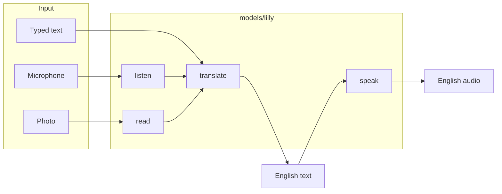

# Lilly

**Real Bosnian → English.** Type it, speak it, or photograph a sign — not generic
Serbo-Croatian dressed up as Bosnian.

[](https://www.python.org/downloads/)
[](https://fastapi.tiangolo.com/)
[](models/lilly/README.md)

---

## Why Lilly exists

Most tools treat Bosnian as “close enough” to Serbian or Croatian. Lilly is built
for people who need **actual Bosnian**: diaspora reading family messages, visitors
reading signs in Sarajevo or Mostar, learners who care about č/ć/đ, and anyone
tired of `>>eng<<` leaking into translations.

| You need… | Lilly gives you… |
| --- | --- |
| Accurate written translation | Fine-tuned Marian model on 350k+ Bosnian–English pairs |
| Spoken Bosnian understood | Whisper listener fine-tuned on Bosnian speech |
| Text on a sign or menu | OCR reader trained on real Bosnian signage + synthetic crops |
| English read aloud | Kokoro TTS (stock) |
| Something wrong? | **“This translation is wrong”** → verified corrections feed retraining |

---

## Demo (add screenshots)

Capture four screens from `http://localhost:8000` into [`docs/images/`](docs/images/)
and they appear here on GitHub:

| | |
| --- | --- |
| **Type** — Bosnian in, English out | `docs/images/demo-translate.png` *(add)* |
| **Speak** — microphone, Bosnian speech → English voice | `docs/images/demo-speak.png` *(add)* |
| **Snap** — photo of a sign → text + translation | `docs/images/demo-photo.png` *(add)* |

Until those exist, run locally (below) or see measured numbers in the
[model card](models/lilly/README.md).

---

## Measured quality (v1, pre-registered)

Honest numbers — same code path the app serves:

| Ability | Metric | Result | Notes |
| --- | --- | --- | --- |
| **Translation** | chrF2 (FLORES-200, 2,009 pairs) | **67.47** | +0.14 vs base; language-tag defect fixed |
| **Speech** | WER (200 held-out clips) | **34.9%** | vs 35.5% previous listener (whisper-small) |
| **Photographs** | Words correct per photo (40 Commons signs) | **54.7%** | Latin Bosnian; up from 36.0% after real-crop training |
| **BosnianBench** | Term recall | 91.5% → 91.7% (p = 0.465) | Does **not** support “understands Bosnian better” — stated in model card |

**v2 in progress:** whisper-**large-v3** listener + longer OCR training on Kaggle.
See [`docs/V2-BOUNDARIES.md`](docs/V2-BOUNDARIES.md).

---

## Architecture



All weights live under `models/lilly/`. One API in [`app/lilly.py`](app/lilly.py):

```python
from app.lilly import lilly

lilly.translate("Dobar dan")       # Bosnian text   → English text
lilly.listen("clip.m4a")             # spoken Bosnian → Bosnian text
lilly.speak("Good day", "out.wav")   # English text   → spoken English
lilly.read("sign.jpg")               # photo          → Bosnian text
```

**Offline at runtime** — weights load from disk; no network call per request.

---

## Quick start

```bash
uv venv .venv --python 3.12
uv pip install --python .venv/bin/python -r requirements.txt

# Weights (~1.3 GB) are not in git
.venv/bin/python scripts/fetch_models.py
.venv/bin/python scripts/build_translator.py

.venv/bin/uvicorn app.server:app --port 8000
# → http://localhost:8000
```

Docker: see [`Dockerfile`](Dockerfile). Needs **~4 GB RAM** for photo requests.

---

## Project layout

```
Lilly/
├── app/              # FastAPI server + glass web UI
├── models/lilly/     # translate, listen, read, speak (not in git — fetch separately)
├── training/         # train & evaluate scripts; Kaggle notebooks
├── data/             # download & clean scripts (large data gitignored)
├── scripts/          # fetch_models, build_translator, kaggle_train, guard, publish_to_hf
└── docs/             # V2-BOUNDARIES, WHITE-PAPER, ROADMAP
```

---

## Training

Heavy training runs on **Kaggle GPU** (T4), not on a laptop — local Mac is 8 GB and
kernel-panicked under parallel jobs.

```bash
python3 scripts/kaggle_train.py speech        # listener fine-tune
python3 scripts/kaggle_train.py speech --status
python3 scripts/kaggle_train.py speech --fetch
```

Translation: `python3 scripts/kaggle_train.py translation`. Details in
[`training/README.md`](training/README.md).

---

## Documentation

| Doc | Purpose |
| --- | --- |
| [`models/lilly/README.md`](models/lilly/README.md) | Model card (HF) — scores, limits, credits |
| [`docs/V2-BOUNDARIES.md`](docs/V2-BOUNDARIES.md) | v2 scope & rules |
| [`docs/WHITE-PAPER.md`](docs/WHITE-PAPER.md) | Sources & licences (filled at v2 release) |
| [`docs/ROADMAP.md`](docs/ROADMAP.md) | Phases |
| [`HANDOFF.md`](HANDOFF.md) | Engineer handoff — traps & measured dead ends |

---

## Design

Glass, calm, Apple-like. Mostar atmosphere — not decoration. No emoji clutter.
Works in the mobile browser; microphone requires HTTPS in production.

---

## Status

- [x] Data pipeline (313k filtered train pairs + 38k extra corpus)
- [x] Translation fine-tune (Arm B shipped)
- [x] Speech listen + English speak
- [x] Photo OCR + translate
- [x] Web app + correction export
- [ ] Hugging Face publish (owner)
- [ ] v2 — large-v3 speech + OCR retrain (Kaggle)

---

## Citation

If you use Lilly in research or a product, cite the repo and link the
[model card](models/lilly/README.md). Full bibliography in
[`docs/WHITE-PAPER.md`](docs/WHITE-PAPER.md) at release.

---

Built by [@ssaaffaakk](https://github.com/ssaaffaakk). Bosnian for people who need
Bosnian — not the closest Slavic language the model already knew.
