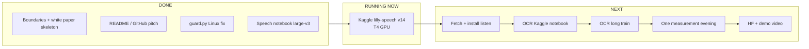
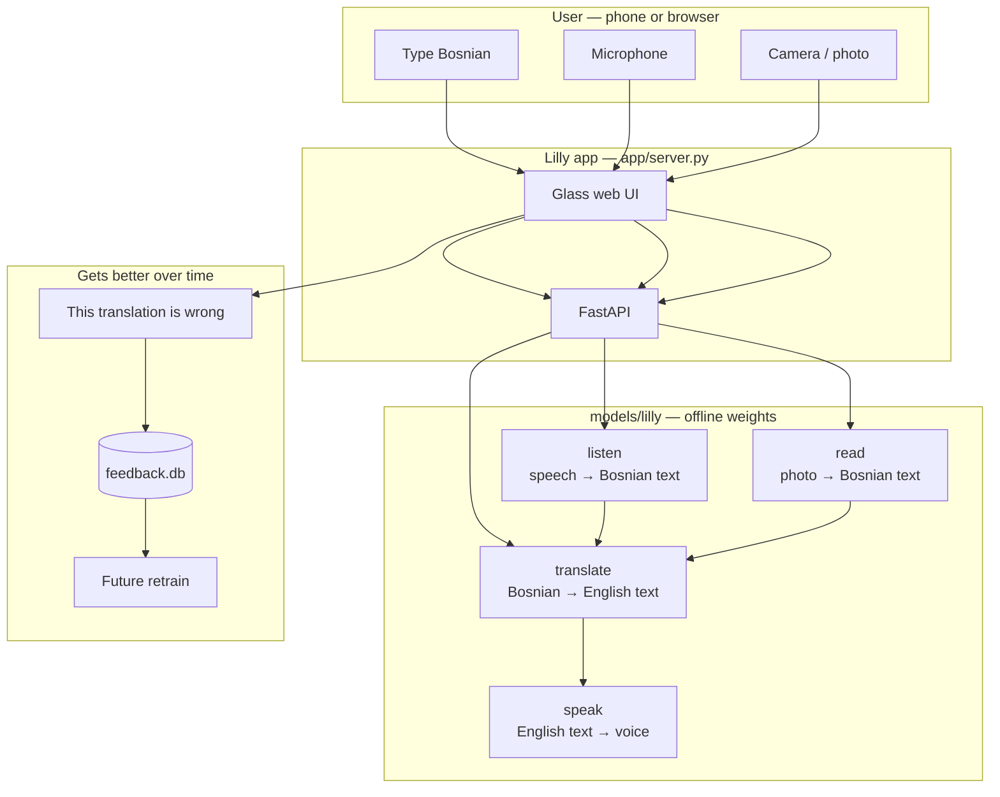
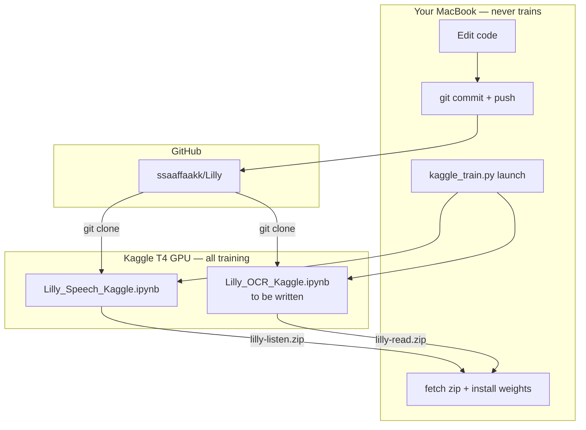
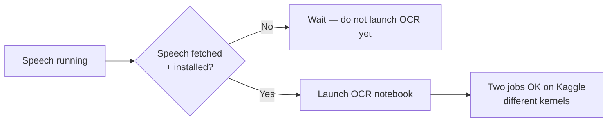

# Lilly v2 — live plan & architecture

**Last updated:** 28 Aug 2026, ~17:15  
**North star:** [`V2-BOUNDARIES.md`](V2-BOUNDARIES.md)  
**Sources (legal, end of project):** [`WHITE-PAPER.md`](WHITE-PAPER.md)

---

## Where we are right now



| Step | Status | Notes |
| --- | --- | --- |
| **0** Boundaries, push discipline | ✅ Done | `docs/V2-BOUNDARIES.md`, commit `c0b7a7f` |
| **1** GitHub / marketing README | ✅ Done | Wolf-style Bosnian-first pitch, `9f5788b` |
| **2** Speech Kaggle large-v3 | 🟡 **RUNNING** | v14 after v13 died (`vm_stat` on Linux — fixed) |
| **3** Fetch + install listener | ⬜ Waiting | ~15 min when v14 completes |
| **4** OCR Kaggle notebook + launch | ⬜ Not started | Write notebook, then second GPU night |
| **5** End measurement (once) | ⬜ After all training | Mac, one queue, ~3–4 h |
| **6** White paper fill + HF publish | ⬜ Last | Every source documented |

**Check Kaggle:** `python3 scripts/kaggle_train.py speech --status`  
**When COMPLETE:** `python3 scripts/kaggle_train.py speech --fetch`

---

## Product architecture (what users touch)



**Scope v2:** upgrade **listen** + **read**. Translation stays v1 Arm B.

---

## Training architecture (where heavy work runs)



**Rule:** Mac loads models only for a quick smoke test after fetch — not for epochs.

---

## Training volume — “train a lot” (the plan)

We are **not** doing one quick epoch and calling it done. v2 is two heavy GPU nights + optional speech pass 2.

### Speech — night 1 (running now)

| Setting | Value | Why |
| --- | --- | --- |
| Base | `openai/whisper-large-v3` | Biggest jump vs whisper-small |
| Method | LoRA r=16 | Fits T4; full fine-tune optional later |
| Mix | 35% Bosnian / 65% Croatian audio | Pre-registered mix |
| Epochs | **3** (default in `train_speech.py`) | ~1–3 h GPU on T4 |
| Batch | 1 × grad accum 16 | Effective batch 16 for large-v3 |
| Data | FLEURS bs + voxpopuli hr + mix TSV | Downloaded inside notebook |

**Pass 2 (train even more — after pass 1 lands):**

| Setting | Value |
| --- | --- |
| Mix share | **0.47** vs 0.25 (new prereg section) |
| Epochs | **+3 to 5** on top of pass-1 weights |
| Trigger | Only if pass-1 WER drops on held-out 200 clips |

### OCR / photographs — night 2 (after speech installed)

| Setting | Planned | Why “a lot” |
| --- | --- | --- |
| Base | EasyOCR latin → `lilly.pth` | Already proven path |
| Train crops | **~22,000 synthetic + 1,294 real** | Full sets, not a subset |
| Epochs | **10** (bump from default 3) | Diacritics need repetition |
| Scope | **Latin only** — no Cyrillic | Owner decision 28 Aug |
| Synthetic emphasis | Oversample đ, č, ć, š, ž | Rarest letters in real labels |
| GPU | Kaggle T4, batch as large as fits | Target **4–8 h** run |

**Optional pass 2 OCR:** another **5 epochs** if invented-word count still above 180 at measurement.

### Translation

**Not in v2 heavy training.** v1 Arm B already wins FLORES. Saves GPU for listen + read.

---

## Hour-by-hour timeline (your nights)

```mermaid
gantt
  title Lilly v2 — hours not days
  dateFormat HH:mm
  axisFormat %H:%M

  section Tonight
  Speech Kaggle v14           :active, s1, 16:00, 4h
  Fetch + install listen      :s2, after s1, 30m

  section Night 2
  Write OCR notebook          :o1, 20:00, 45m
  OCR Kaggle train 10 ep      :o2, after o1, 6h
  Fetch + install read        :o3, after o2, 30m

  section Evening 3
  Measure speech + OCR once   :m1, 18:00, 4h

  section Evening 4
  White paper + HF + demo     :p1, 18:00, 3h
```



---

## What “success” looks like (honest targets)

Not perfect — **clearly better for real Bosnian users:**

| Ability | v1 | v2 target (measure once at end) |
| --- | --- | --- |
| Speech WER | 34.9% (small) | **Large drop** with large-v3 + long train |
| Photo words / sign | 54.7% | **60%+** per photo, invented ≤ **180** |
| Demo | Works | 60 s phone video: speak + snap sign |

---

## Parallel Kaggle runs?



**Tonight:** one job (speech). **After listen is on disk:** OCR can run while you sleep — still zero Mac training load.

---

## Commands cheat sheet

```bash
# Status
python3 scripts/kaggle_train.py speech --status

# After COMPLETE
python3 scripts/kaggle_train.py speech --fetch
# unzip → models/lilly/listen/ (backup old first)

# Before any launch
python3 scripts/state.py   # must say clean + GitHub has HEAD

# Future
python3 scripts/kaggle_train.py ocr      # after notebook exists
```

---

## Progress bar (manual update)

```
[████████░░░░░░░░░░░░] 40%  — speech training in flight
```

Update this file when a step completes. Next update: when v14 → COMPLETE or ERROR.
