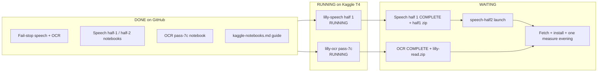

# Lilly v3 — live plan (fail-stop + speech halves + OCR pass-7c)

> **Stale since 3 Sep 2026.** The status table below is from 31 Aug — OCR
> pass-7c is long finished, and passes 8–19 came and went after it. For the
> reader, `OCR-ROADMAP.md` is current. Nothing here about speech has been
> re-checked.

**Last updated:** 31 Aug 2026  
**North star still:** [`V2-BOUNDARIES.md`](V2-BOUNDARIES.md) (Latin Bosnian, Kaggle not Mac, push everything except secrets)  
**Notebook law:** [`kaggle-notebooks.md`](kaggle-notebooks.md)  
**Mistake list:** [`kaggle-fail-stop.md`](kaggle-fail-stop.md)  
**Live status / half-2 wait:** this file  
**Cursor always-apply:** `.cursor/rules/kaggle-fail-stop.mdc`  
**Code on GitHub:** `80977ae` (`main`) at time of writing

v3 is not a new product scope. It is the **operations and correctness layer** on
top of v2: stop completing past known failures, split speech so the 12h wall
can finish a zip, and make OCR harvest + install gate real launch requirements.

---

## Where we are right now



| Lane | Status | Notes |
| :--- | :--- | :--- |
| **Speech half 1** | 🟡 **RUNNING** | https://www.kaggle.com/code/safaksideacc2/lilly-speech — 1 epoch, adapter zip only |
| **OCR pass-7c** | 🟡 **RUNNING** | https://www.kaggle.com/code/safaksideacc2/lilly-ocr — harvest required, gate before zip |
| **Speech half 2** | ⬜ **Waiting** | Do **not** launch until half 1 is COMPLETE with a fresh `lilly-listen-half1.zip` |
| **Fetch / install** | ⬜ After COMPLETE | Speech app zip only after half 2; OCR `lilly-read.zip` after OCR COMPLETE |
| **End measurement** | ⬜ After installs | One Mac queue; not during training |
| **Docs / fail-stop** | ✅ On `main` | `d3c37b4` code, `80977ae` notebook guide |

**GPU:** Kaggle allows **2** batch GPU sessions. Both slots are in use. Do not
launch translation or half 2 until a slot frees.

**Poll (CANCEL/ERROR = fail even with a zip):**

```bash
python3 scripts/kaggle_poll.py
python3 scripts/kaggle_train.py speech --status
python3 scripts/kaggle_train.py ocr --status
```

**SHA the boxes clone:** whatever was on GitHub at push time. Current runs were
launched from `d3c37b4` (fail-stop). Doc commit `80977ae` does not change the
running kernels until relaunch.

---

## What we added (inventory)

### Docs / memory

| Path | Why |
| :--- | :--- |
| `docs/kaggle-notebooks.md` | Full writing guide: skeleton, wrong/right snippets, cell contracts, anti-patterns |
| `docs/kaggle-fail-stop.md` | Short numbered list of past COMPLETE-past-failure mistakes |
| `.cursor/rules/kaggle-fail-stop.mdc` | Always-apply for agents |
| `docs/agent-teams-lilly.md` rule 9 | Band-aid = COMPLETE past gate; GitHub is the store |
| `docs/V3-PLAN.md` | This file — where we are and what waits |

### Speech pipeline

| Path | Why |
| :--- | :--- |
| `training/Lilly_Speech_Kaggle.ipynb` | Half 1: 1 epoch, `--keep-adapter`, no WER, zip `lilly-listen-half1.zip` |
| `training/Lilly_Speech_Kaggle_Half2.ipynb` | Half 2: `--resume`, epoch 2, AFTER WER then `lilly-listen.zip` |
| `training/train_speech.py` | `--keep-adapter`, `--resume`, Encoder 0-grad → exit, NaN/Inf → exit |
| `scripts/kaggle_train.py` | Jobs `speech` + `speech-half2`, kernel_sources for half 2 |
| `scripts/preflight_kaggle.py` | Blocks relaunch of the old one-session / skip-WER recipes |

### OCR pipeline

| Path | Why |
| :--- | :--- |
| `training/Lilly_OCR_Kaggle.ipynb` | Pass-7c: harvest required, real before syn, `-u` train, zip after gate |
| `training/train_ocr.py` | Install gate; `--keep-trained` only after pass; short run → return 1 |
| `training/evaluate_ocr.py` | Photo hole → stop (local score; not on Kaggle box) |
| `scripts/kaggle_train.py` | `push_ocr_harvest` None → `SystemExit`, no launch |
| `scripts/kaggle_poll.py` | CANCEL/ERROR crash; COMPLETE needs fresh zip |

### Shared ops

| Path | Why |
| :--- | :--- |
| `scripts/preflight_kaggle.py` | Single gate before every `kaggle_train.py` launch |
| Clone → `/kaggle/temp` | `/kaggle/working` clone floods Output; zip never downloads |

---

## Why we changed the code — speech

### Root cause

Two epochs of whisper-large-v3 + BEFORE/AFTER WER + merge ~3 GB in **one**
Save & Run All session hit Kaggle’s **12h wall**. CANCEL → zip 404. Agents then
tried illegal “optimizations”: skip WER, zip merged weights, warn on 0-grad,
clone into working, treat CANCEL+zip as success.

### What changed (speech)

| Hole | Now | Why |
| :--- | :--- | :--- |
| 2 epochs + BEFORE/AFTER WER in one session | Split half 1 / half 2 | Wall clock; measurement stays on the **ship** half |
| Clone into `/kaggle/working` | Clone `/kaggle/temp` | Working = Output; git objects drown the zip fetch |
| Zip merged large-v3 (~3 GB) as the artefact | Half 1: `--keep-adapter` → `lilly-listen-half1.zip` | Small Trainer checkpoint; cancel-safe enough to resume |
| `--base` merged folder called “epoch 2” | Half 2: `--resume` + `SPEECH_EPOCHS = 2` | New LoRA on merged weights is **not** epoch 2; optimizer/schedule must continue |
| Encoder LoRA 0-grad → warn, keep training | `EncoderGradientCheck` → `SystemExit` | Hours of GPU on a dead adapter is not a run |
| NaN/Inf loss filtered out of logs | `FiniteLossCheck` + `logging_nan_inf_filter=False` | Filtered NaN still “COMPLETEs” garbage |
| Skip AFTER WER so kernel COMPLETEs | Half 2: WER **then** `lilly-listen.zip` | Unmeasured app zip is not shippable |
| Failed download split/shard → `return 0` | Download scripts exit 1 / refuse partial | Smaller corpus is not a successful download |
| CANCEL + old zip treated as done | `kaggle_poll.py`: CANCEL/ERROR = crash | Recovery ≠ this run succeeded |
| Leave fix “local only” | Commit + push (no secrets) | Kaggle clones GitHub |

### Half 1 vs half 2 (product contract)

| | Half 1 (running now) | Half 2 (waiting) |
| :--- | :--- | :--- |
| Notebook | `Lilly_Speech_Kaggle.ipynb` | `Lilly_Speech_Kaggle_Half2.ipynb` |
| Launch | `python3 scripts/kaggle_train.py speech` | `python3 scripts/kaggle_train.py speech-half2` |
| Epochs | `SPEECH_EPOCHS = 1` | `SPEECH_EPOCHS = 2` + `--resume` |
| WER | **None** (by design) | AFTER WER required before app zip |
| Output | `lilly-listen-half1.zip` (adapter + `trainer_state.json`) | `lilly-listen.zip` (app) + optional half2 adapter zip |
| Mix | `BOSNIAN_SHARE = 0.47`, fleurs_hr + voxpopuli_hr | **Same** recipe |
| Fail-stop skeleton | `/kaggle/temp`, `check=True`, LoRA smoke | **Same** skeleton + WER gate |

Half 1 COMPLETE without WER is **allowed**. Half 2 COMPLETE without WER is
**forbidden**.

---

## Why we changed the code — OCR

### Root cause

Same COMPLETE-past-failure pattern as speech: missing harvest → synthetic-only
train; `check=False` → zip refused weights; keep-trained written before the
install gate; poller happy on CANCEL+zip; photo eval skipped failures and still
printed a %.

### What changed (OCR)

| Hole | Now | Why |
| :--- | :--- | :--- |
| Launch OCR without harvest photos | `kaggle_train.py`: `push_ocr_harvest` → None → `SystemExit` | Pass-7c is a harvest pass; silent skip relaunches the drowned-label failure mode |
| Notebook trains synthetic-only | `Lilly_OCR_Kaggle.ipynb` → `raise SystemExit` if harvest missing | “Human + syn only” was a COMPLETE that did not test the pass |
| Markdown said harvest “if present” | Markdown: **all required** (`lilly-read-pass1`, crops, harvest) | Agents optimize against the header |
| `check=False`, zip refused, assert 0 | `run(..., check=True)`; no zip on non-zero | Inspection zip in Output looks shippable |
| `--keep-trained` written, then gate refuses | Write keep-trained **only after** gate passes | Refused `read-trained.pth` must not look installable |
| Too-short run still exit 0 | `steps < MIN_STEPS` → return 1 | Seconds of train waved through on noise |
| CANCEL/ERROR but a zip exists | `kaggle_poll.py`: always crash | Leftover/undersized zip ≠ this run |
| Photo read fails, score continues | `evaluate_ocr.py`: hole → stop / return 1 | A % with missing photos is a lie |
| Real crops after synthetic | Real merge **before** generate | `prepare_ocr_data` wipes `syn*`; wrong order → ~2 min “train” |
| Unfiltered EasyOCR auto-crops | `AUTO_MIN_CONF`, `AUTO_CAP_MULT`; `auto*` train-only | Valid must not score EasyOCR against itself |
| Buffered train log hid refusal | `python -u` / `PYTHONUNBUFFERED` | Gate refusal never reached the Kaggle log |
| pip-install torch from requirements | Do not; use Kaggle GPU torch | CPU wheels break CUDA |
| Clone `/kaggle/working` | Clone `/kaggle/temp` | Same Output flood as speech |
| On-box photo `evaluate_ocr` without truth | **Not** on Kaggle; gate = `train_ocr` install gate | Would false-fail or tempt skip-holes |

### OCR artefacts

| Zip | Meaning |
| :--- | :--- |
| `lilly-read.zip` | **Install this** — `lilly.pth` + `user_network` |
| `lilly-read-trained.zip` | Trained weights after a **passed** gate; not the app layout |

---

## Shared fail-stop (both lanes)

These apply to speech **and** OCR. Do not reopen.

```text
1. run(..., check=True) / SystemExit — never check=False then zip then assert
2. Clone /kaggle/temp — never /kaggle/working
3. Measure / install gate BEFORE shippable zip
4. CANCEL and ERROR are failures even if a zip was recovered
5. GitHub is the store — commit and push (never tokens / kaggle.json / .env)
6. Fix the cause and relaunch — do not bandage the pipeline to COMPLETE
7. Max 2 batch GPUs — do not launch into a full quota
8. Preflight must pass — and must be updated in the same commit as notebook edits
9. Skipping a gate to beat the 12h wall is an illegal variant, not an optimization
```

---

## Speech half 2 — waiting plan (every detail)

### Preconditions (all must be true)

```text
[ ] Half 1 api status is COMPLETE (not CANCEL, not ERROR, not RUNNING)
[ ] Fresh lilly-listen-half1.zip on that version Output (size >> 1 MB)
[ ] kaggle_poll.py does NOT mark speech as crashed
[ ] At least one GPU slot free (OCR may still be RUNNING — wait or stop only if owner asks)
[ ] git status clean; HEAD on origin/main; preflight exits 0
[ ] Do NOT use an old leftover zip from a cancelled half-1 version
```

### What half 2 will do (in order)

1. GPU + Internet + `run(check=True)`
2. Clone Lilly to `/kaggle/temp`
3. pip pins + LoRA CUDA smoke
4. Re-download Bosnian + fleurs_hr + voxpopuli_hr; rebuild mix `share=0.47`
5. Attach / find `lilly-listen-half1.zip` under `/kaggle/input`; require `trainer_state.json`
6. `train_speech.py --resume <adapter> --epochs 2 --no-convert` (continues epoch 2)
7. Convert merged weights → `models/lilly/listen`
8. **`evaluate_speech.py`** on `data/speech/test.tsv` (`--limit 200`)
9. Only then zip **`/kaggle/working/lilly-listen.zip`**

If step 8 fails → no app zip. That is success of the fail-stop, not a bug.

### Launch command (only when preconditions hold)

```bash
python3 scripts/preflight_kaggle.py
python3 scripts/kaggle_train.py speech-half2
```

Kernel: `safaksideacc2/lilly-speech` metadata for half 2 uses the half-2 notebook
and `kernel_sources` pointing at half 1 Output (see `kaggle_train.py` job
`speech-half2`). Confirm accelerator is T4 after push.

### After half 2 COMPLETE

```bash
python3 scripts/kaggle_train.py speech-half2 --status   # or poll
# fetch Output when COMPLETE + lilly-listen.zip present
# install into models/lilly/listen/ — keep previous listener as backup
```

Do not install from `lilly-listen-half1.zip` or `lilly-listen-half2.zip` into the
app path. Those are Trainer checkpoints / resume aids.

### Half 2 anti-patterns while waiting

```text
✗ Launch half 2 while half 1 still RUNNING
✗ Launch half 2 after CANCEL because “zip name still shows in Output”
✗ --base merged listen-trained and call it epoch 2
✗ SPEECH_EPOCHS = 1 on half 2
✗ Skip evaluate_speech to beat the wall
✗ Zip lilly-listen.zip before WER
✗ Start half 2 on CPU / wrong machine_shape
✗ Third GPU job while OCR still holds a slot (if limit is 2)
```

---

## OCR lane while we wait on speech half 2

OCR is independent. When OCR COMPLETEs:

```text
[ ] Status COMPLETE (not CANCEL/ERROR)
[ ] Fresh lilly-read.zip (and preferably lilly-read-trained.zip after passed gate)
[ ] Poll not crashed
[ ] Unzip lilly-read.zip over repo models path; keep latin_g2.pth / previous lilly.pth
[ ] Do not install from a refused / undersized leftover
```

If OCR ERRORs: read log, fix cause on GitHub, relaunch — do not zip around the gate.

---

## Next after both products land

1. One measurement evening on the Mac (boundaries: train first, measure last).
2. Fill `docs/WHITE-PAPER.md` sources.
3. HF / demo only after numbers are from the installed builds.

---

## Command cheat sheet

```bash
# status
python3 scripts/kaggle_poll.py

# when half 1 done and a GPU slot free
python3 scripts/kaggle_train.py speech-half2

# OCR was already launched; relaunch only after ERROR + fix + push
python3 scripts/kaggle_train.py ocr

# before any launch
python3 scripts/preflight_kaggle.py
```

Links:

- Speech: https://www.kaggle.com/code/safaksideacc2/lilly-speech  
- OCR: https://www.kaggle.com/code/safaksideacc2/lilly-ocr  

---

## Related commits (recent)

| SHA | What |
| :--- | :--- |
| `80977ae` | `docs/kaggle-notebooks.md` + OCR markdown harvest required |
| `d3c37b4` | OCR fail-stop (harvest, poll, keep-trained, evaluate holes) |
| `7d8ab3e` | Speech (+ shared) fail-stop |
| `a081581` / `9324804` | Speech half 1 / half 2 split |
| `b00d630` | OCR pass-7c harvest filter + CUDA cropper |
